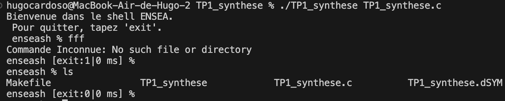
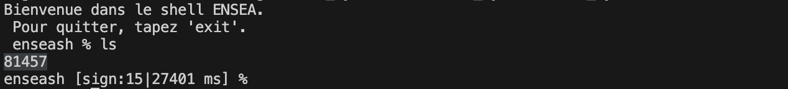

# Compte rendu TP1 synthèse : 

Ce TP m'a permis d'acquérir différentes connaissances : 

La question 2 m'a permis de mieux appréhender la création d'un processus fils (qu'il soit exécuté, non exécuté ou que ce soit le processus parent qui soit exécuté).
Grace à ça j'ai pu créer la boucle qui m'as permis d'écrire des commandes dans mon shell.

La question 4 m'a causé problème car je ne comprenais pas comment "tuer" le signal. 
Premièrement j'ai appris a utiliser des boucles sur la commande "WIFEXISTED" pour savoir si la commande existait "exit:0" ou n'existait pas "exit:1".
La boucle sur la commande "WIFSIGNALED" m'a donc permis de pouvoir tuer le signal lorsque je le voulais. Pour ça j'ai compris qu'il fallait recuperé l'adresse du PID afin de fermer le fils à l'aide d'un signal extérieur. Pour avoir ce signal il faut donc lancé un autre terminal car le notre est en "sleep".

